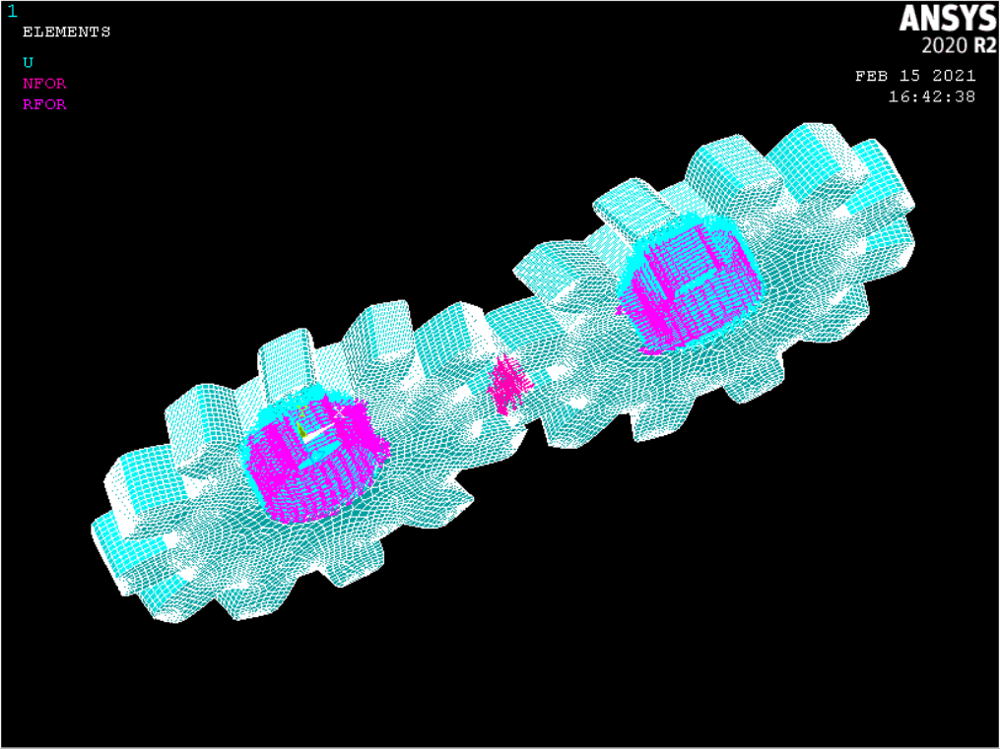
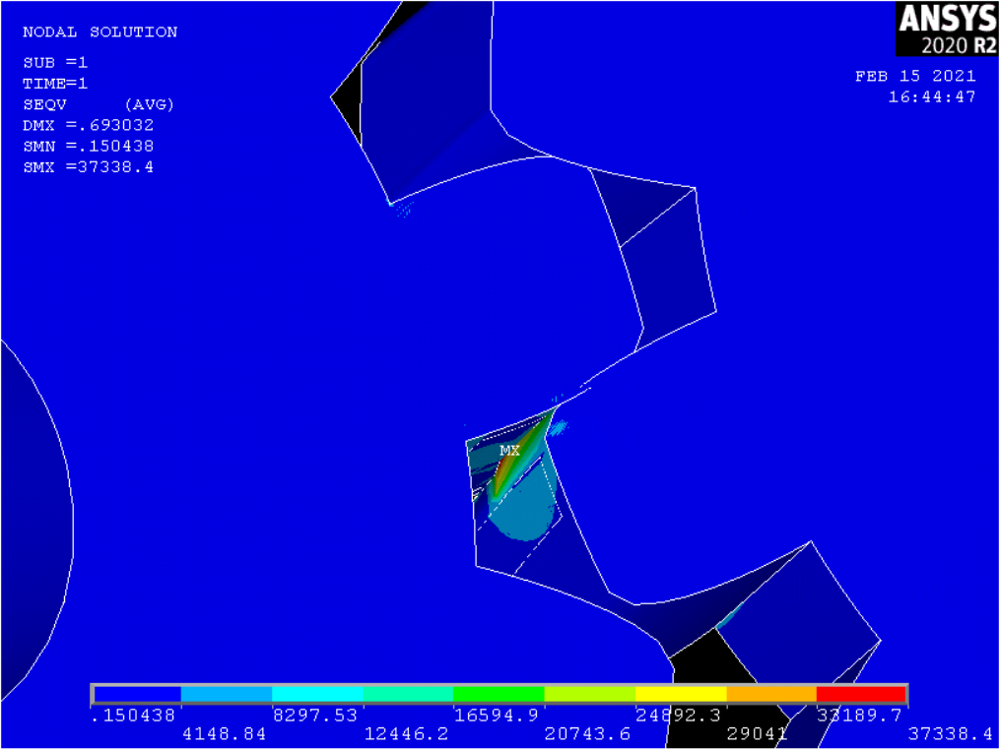
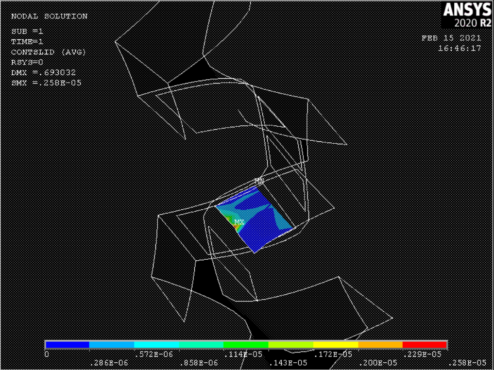

<!-- more -->

### 建模思路和注意事项

1.先画出半个齿的轮廓线，通过镜像生成一个齿，再利用柱坐标系旋转阵列复制出完整的轮廓线

2.半个齿的渐开线（这里做了简化，用了二次曲线替代真正的渐开线）部分利用柱坐标系，通过模拟极坐标方程轨迹法描出关键点，再用样条线连接

3.斜齿轮需要用齿廓样条线，使用VDRAG（拖拽）命令将齿面沿生成好的齿廓样条线拖拽成体

4.由于孔与键槽与齿面垂直，所以不应在做齿面的时候就先做，而是拖拽成体后再做

5.斜齿轮分为左旋与右旋，所以应当先复制齿面，然后两个齿轮沿两个相反的方向画出样条线

6.由于用VDRAG拖拽成体，齿轮体没有划分网格，所以可以先用PLANE182划分齿面，再通过VSWEEP（扫掠）用SOLID185划分整个齿轮体

### APDL命令流实现

```
!圆柱斜齿轮副的接触分析 MPC 算法接触处理
FINISH
/CLEAR
/FILNAME, HELICAL_GEAR_3D
/PREP7

MP, EX, 1, 2E5
MP, PRXY, 1, 0.3
MP, DENS, 1, 8E-9
MP, MU, 1, 0.2

ET, 1, SOLID185
ET, 2, PLANE182

KEYOPT, 2, 1, 1
R, 2, , 4

*SET, RB, 30    !基圆半径
*SET, RA, 40    !大径长之半
*SET, DELTA, 10   !细分次数
*SET, THETA, 5    !渐开线展角
*SET, H, 10   !齿厚
!通过极坐标系用轨迹法描出齿廓线的相应关键点
*SET, OMEGA, THETA/DELTA
*DO, i, 0, DELTA, 1
*SET, LR, -0.4*OMEGA*i*OMEGA*i    !极轴长
LOCAL, 11, 0, 0, 0, 0, OMEGA*i
CSYS, 11
K, , LR+RA, 0, 0
*ENDDO

BSPLIN, ALL   !用样条线连接
CSYS, 0
LOCAL, 11, 1
LGEN, 2, ALL, , , 0, 5, 0, , , 1
K, , 0, 0, 0
*GET, KP1, KP, , NUM, MAX
CSYS, 0
!补全半个齿的轮廓线
CIRCLE, KP1, RA, , , 5    !画圆弧线
CIRCLE, KP1, RB, , , 5
*GET, KP1, LINE, , NUM, MAX
CSYS, 11
LGEN, 2, KP1, KP1, 1, 0, 10, 0, , , 1
CSYS, 0
!镜像，补全为一个完整的齿
LSYMM, Y, ALL
CSYS, 11
!旋转阵列，做出整个齿轮的轮廓线
LGEN, 12, ALL, , , 0, 30, 0
LGLUE, ALL
!填充齿轮面
AL, ALL

LGLUE, ALL
*SET, MOVE, RA/8-RA/32    !齿轮中心距微调量
*SET, A0, 14*RA/8+MOVE   !齿轮副中心距
*SET, DTHETA, 10    !齿轮相错角
!平移复制，生成第二个齿轮面
CSYS, 0
AGEN, 2, ALL, , , A0
LOCAL, 11, 1, A0, 0, 0

!通过极坐标系用轨迹法描出齿侧螺旋母线的相应关键点
!外层循环控制定位到每个齿轮
!内层循环控制每次轨迹法的描点步骤
!----------循环开始
*DO, j, 0, 1, 1
*GET, KP1, KP, , NUM, MAX
CSYS, 0
K, KP1+1, RA+A0*j   !在齿尖建立第一个关键点
*GET, KP1, KP, , NUM, MAX
*SET, DH, H/DELTA   !Z轴方向每次移动长度
!
LSEL, NONE
*DO, i, 0, DELTA-1, 1
LOCAL, 11, 1, A0*j, 0, DH*(i+1)*(-1)**j, OMEGA*(i+1)    !局部系在齿面向平面内旋转，垂直方向上平移
CSYS, 11
K, KP1+1, RA
L, KP1, KP1+1
*SET, KP1, KP1+1
*ENDDO

CSYS, 0
LCOMB, ALL    !将每次划分的所有线段连成一条样条线
*IF, j, EQ, 0, THEN   !分别获取两条样条线各自的编号
*GET, LINE1, LINE, , NUM, MAX
*ELSE
*GET, LINE2, LINE, , NUM, MAX
*ENDIF
CSYS, 11
*ENDDO
!----------循环结束

*GET, AREA1, AREA, , NUM, MIN
*GET, AREA2, AREA, , NUM, MAX
!将两个齿面分别沿两条样条线方向拉伸成齿体
ALLSEL, ALL
*DO, j, 0, 1, 1
CSYS, j*11
VDRAG, (-j+1)*AREA1+j*AREA2,,,,,,(-j+1)*LINE1+j*LINE2
*ENDDO

*GET, VOLU1, VOLU, , NUM, MAX
*GET, VOLU2, VOLU, , NUM, MIN
LOCAL, 11, 1, A0, 0, 0
VGEN, 2, VOLU1, VOLU1, 1, , DTHETA, 0, , , 1    !将一个齿轮整体旋转一个角度 DTHETA
LOCAL, 11, 0, A0, 0, 0
VGEN, 2, VOLU1, VOLU1, 1, , 0, H, , , 1   !将该齿轮沿Z方向上平移一个 H，对齐全局坐标系的XOY平面
!齿体开挖内孔与键槽
CSYS, 0
VSEL, NONE
CYL4, 0, 0, RA/4, 0, 0, 360, H    !内孔部分
BLC5, 0, RA/4, RA/4, RA/8, H    !键槽部分
VADD, ALL   !待挖去体合为一体，方便后续操作
VGEN, 2, ALL, , , A0, 0, 0
*GET, VOLU3, VOLU, , NUM, MIN
LOCAL, 11, 1, A0, 0, 0
VGEN, 2, VOLU3, VOLU3, 1, , DTHETA, 0, , , 1    !复制第二份至另一个齿轮上，附加一个转角
*GET, VOLU3, VOLU, , NUM, MAX
*GET, VOLU4, VOLU, , NUM, MIN

ALLSEL, ALL
CSYS, 0
VSBV, VOLU1, VOLU4    !布尔减，挖出内孔与键槽
VSBV, VOLU2, VOLU3
!划分网格，赋予齿面以二维实体单元
LSEL, S, LOC, Z, H
LESIZE, ALL, , , 8
ASEL, S, LOC, Z, H
AATT, 1, -1, 2
AMESH, ALL

*GET, VOLU3, VOLU, , NUM, MAX
*GET, VOLU4, VOLU, , NUM, MIN
!利用扫掠赋予整个齿轮三维实体单元
VSWEEP, VOLU3
VSWEEP, VOLU4

*SET, EID, 3
*SET, RID, 3

!添加接触对
VSEL, S, , , VOLU4, VOLU4, 1
ASLV, S
LOCAL, 11, 1
ASEL, R, LOC, Z, H/4, 3*H/4
ASEL, U, LOC, X, 0, RA/2
ASEL, R, LOC, Y, 2.5, 15
NSLA, S
ET, EID, TARGE170
TYPE, EID
R, RID
REAL, RID
ESURF

*SET, EID, EID+1
LOCAL, 11, 1, A0
VSEL, S, , , VOLU3, VOLU3, 1
ASLV, S
ASEL, R, LOC, Z, H/4, 3*H/4
ASEL, U, LOC, X, 0, RA/2
ASEL, R, LOC, Y, 182.5, 190
NSLA, S
ET, EID, CONTA174
KEYOPT, EID, 2, 2
KEYOPT, EID, 12, 5
TYPE, EID
REAL, RID
ESURF

*SET, EID, EID+1
*SET, RID, RID+1
!添加接触对
VSEL, S, , , VOLU4, VOLU4, 1
ASLV, S
LOCAL, 11, 1
ASEL, R, LOC, Z, H/4, 3*H/4
ASEL, U, LOC, X, 0, RA/2
ASEL, R, LOC, Y, -7.5, 0
NSLA, S
ET, EID, TARGE170
TYPE, EID
R, RID
REAL, RID
ESURF

*SET, EID, EID+1
LOCAL, 11, 1, A0
VSEL, S, , , VOLU3, VOLU3, 1
ASLV, S
ASEL, R, LOC, Z, H/4, 3*H/4
ASEL, U, LOC, X, 0, RA/2
ASEL, R, LOC, Y, 180, 190
NSLA, S
ET, EID, CONTA174
KEYOPT, EID, 2, 2
KEYOPT, EID, 12, 5
TYPE, EID
REAL, RID
ESURF

NUMMRG, ALL, , , , LOW

/SOLU
ANTYPE, 0
NLGEOM, 1

!孔内加边界条件
LOCAL, 11, 1
VSEL, S, , , VOLU4, VOLU4, 1
ASLV, S
ASEL, R, LOC, X, 0, RA/2
ASEL, U, LOC, Z, 0
ASEL, U, LOC, Z, H
NSLA, S
D, ALL, UX
D, ALL, UY, -1
D, ALL, UZ

LOCAL, 11, 1, A0
VSEL, S, , , VOLU3, VOLU3, 1
ASLV, S
ASEL, R, LOC, X, 0, RA/2
ASEL, U, LOC, Z, 0, 0.1
ASEL, U, LOC, Z, H
NSLA, S
D, ALL, ALL

CSYS, 0
ALLSEL, ALL
SOLVE

/POST1
PLNSOL, S, EQV
```

### 结果展示







